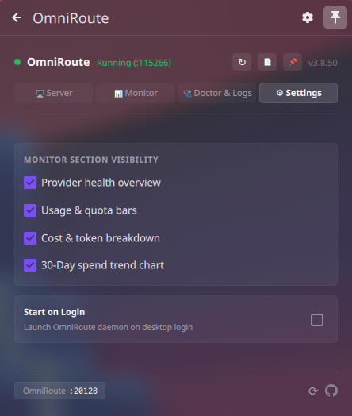

# OmniRoute Tray (Linux/KDE)

A Linux system-tray app and KDE Plasma 6 widget that supervises, monitors, and auto-updates the [OmniRoute](https://www.npmjs.com/package/omniroute) AI router. It replaces the manual workflow of starting `omniroute serve`, keeping it running across reboots, and updating it by hand.

Inspired by [zoispag/omniroute-tray](https://github.com/zoispag/omniroute-tray) (macOS). This is the native Linux port — a PySide6 system-tray app + a KDE Plasma 6 plasmoid widget.

## Screenshots

| | |
|---|---|
|  |  |
|  |  |

## Features

- **Tray-only** — a rich popover card from the system tray, no extra windows.
- **KDE Plasma 6 widget** — native QML plasmoid with tabbed Server, Monitor, Doctor & Logs, and Settings views.
- **Supervised server** — spawns and keeps `omniroute serve` running, adopting an already-running instance instead of spawning a duplicate.
- **Live usage** — provider quota bars, Claude/Gemini/OpenAI session limits with reset countdowns (`% left` / `% used` toggle), and a 30-day cost breakdown.
- **Spend analytics** — 1D, 7D, 30D cost ranges with per-model breakdown and `%` vs `in/out` token toggle.
- **30-day trend** — interactive sparkline bar chart with hover tooltips.
- **Auto-update** — detects new OmniRoute releases via npm registry.
- **Start on login** — optional XDG autostart desktop entry.
- **Doctor & logs** — one-click diagnostics (Node, CLI, DB, loopback auth, server status) and server log viewer.
- **Flat vector icon** — crisp white hub & spokes with 6 color-changing outer points (red when running, white when stopped).

## Components

| Component | Description |
|---|---|
| `omniroute_tray.py` | PySide6 system-tray app with glassmorphic dark popover |
| `org.omniroute.plasmoid/` | KDE Plasma 6 QML widget (plasmoid) |
| `omniroute.svg` | App icon (white) |
| `omniroute_red.svg` | App icon (red, running state) |

## Install

### System Tray App (PySide6)

**Requirements:** Python 3.10+, PySide6, OmniRoute CLI

```sh
# Install PySide6
pip install PySide6

# Copy the tray app
cp omniroute_tray.py ~/.local/bin/omniroute-tray
chmod +x ~/.local/bin/omniroute-tray

# Run
omniroute-tray
```

### KDE Plasma 6 Widget

```sh
# Install the plasmoid
cp -r org.omniroute.plasmoid ~/.local/share/plasma/plasmoids/

# Restart Plasma to detect it
plasmashell --replace &
```

Then add the "OmniRoute" widget to your panel via right-click → Add Widgets.

### CLI Shortcuts

```sh
omniroute-tray --start       # Start the OmniRoute server daemon
omniroute-tray --stop        # Stop all OmniRoute processes
omniroute-tray --restart     # Restart the server
omniroute-tray --snapshot    # Dump full telemetry snapshot as JSON
omniroute-tray --toggle-autostart  # Toggle start-on-login
```

## How it works

- The tray app supervises `omniroute serve --daemon`, adopting an already-running instance if one is detected on port 20128.
- It shares your existing `~/.omniroute/` config and database.
- Server data (quotas, cost, health) is read via the OmniRoute CLI (`--output json`) and HTTP API on `127.0.0.1:20128`.
- Loopback authentication uses HMAC-SHA256 derived from `/etc/machine-id` (or `~/.omniroute/.env` token).
- The Plasma widget delegates server lifecycle and data fetching to `omniroute-tray` CLI commands.

## Configuration

Settings are stored in `~/.config/omniroute-tray/settings.json`:

```json
{
  "serve_command": ["omniroute"],
  "api_base": "http://127.0.0.1:20128",
  "poll_interval_seconds": 15,
  "start_on_login": false,
  "percent_mode": "left",
  "cost_range": "30d",
  "cost_mode": "pct",
  "adopt_existing": true,
  "hidden_sections": []
}
```

## License

MIT
