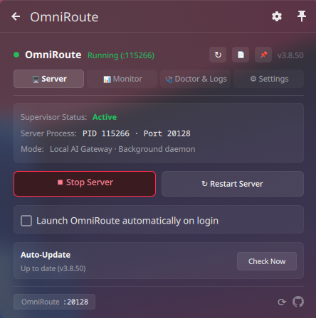
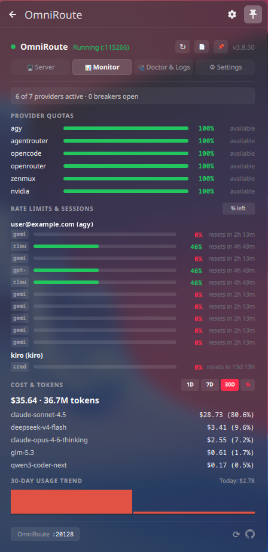
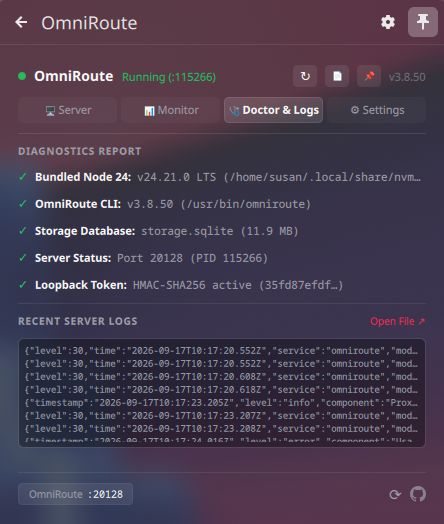

# OmniRoute Tray for Linux

<p align="center">
  
</p>

<p align="center">
  <strong>A system tray supervisor, telemetry dashboard, diagnostics tool, and auto-updater for <a href="https://github.com/diegosouzapw/OmniRoute">OmniRoute</a> on Linux.</strong>
</p>

<p align="center">
  <a href="https://github.com/Susanthakuri92/omniroute-tray-linux/actions/workflows/ci.yml"></a>
  <a href="#features"></a>
  <a href="#desktop-environment-support"></a>
  <a href="#requirements"></a>
  <a href="#license"></a>
</p>

---

OmniRoute Tray replaces the manual terminal workflow of starting `omniroute`, keeping it alive across
logins, tailing logs, and upgrading by hand. It ships as two interfaces over one shared core:

1. **Native KDE Plasma 6 widget (Plasmoid)** — a tabbed popover built with native QML, integrated
   directly into your panel or system tray. Needs only Python 3 and Git; no PySide6, no Electron.
2. **Universal Qt tray (PySide6)** — a dark popover for **GNOME**, **XFCE**, **Cinnamon**, **MATE**,
   **LXQt**, and tiling Wayland/X11 compositors (**Hyprland**, **Sway**, **i3**).

Both interfaces read the same telemetry and control the same daemon, so you can switch between them
without reconfiguring anything.

Inspired by [zoispag/omniroute-tray](https://github.com/zoispag/omniroute-tray) (macOS).

---

## Screenshots

| 🖥️ Server Supervisor | 📊 Telemetry & Quotas | 🩺 Diagnostics & Logs |
| :---: | :---: | :---: |
|  |  |  |

---

## Features

- **Process supervision & adoption** — start, stop, and restart the OmniRoute daemon. An
  already-running instance on port `20128` is adopted rather than duplicated.
- **Provider health & breakers** — live badge showing active providers and open circuit breakers.
- **Live quotas** — progress bars for Claude, OpenAI, Gemini, and custom providers, with reset
  countdowns and a `% left` / `% used` toggle.
- **Spend & token analytics** — 24-hour, 7-day, and 30-day aggregation with per-model breakdown,
  token counts, and `% share` toggles.
- **30-day trend sparkline** — daily spend chart with hover tooltips.
- **Doctor diagnostics** — one-click checks for the Node.js runtime, the OmniRoute CLI, SQLite
  database health, and loopback authorization. Every check probes live system state.
- **Live log viewer** — streaming server log with a shortcut to open log files in your editor.
- **Updates center** — separate cards for the server and the tray, live version badges and commit
  hash, a one-click tray self-update from GitHub, and an update banner with a copyable
  `npm i -g omniroute@latest` command when a newer server release exists.
- **Single-instance protection** — kernel file locks and desktop-containment detection prevent
  duplicate tray icons.
- **Desktop autostart** — one-click toggle, implemented via XDG autostart.
- **Dynamic tray icon** — vector-rendered OmniRoute glyph, white when stopped and red when running.

---

## Requirements

- **Linux** with a system tray (X11 or Wayland).
- **Python 3.10+** and **Git**.
- **PySide6** — only for the standalone Qt tray. Not needed for the KDE Plasma widget or the CLI.
- The `omniroute` CLI must be installed and on your `PATH` (or set `serve_command` in settings).

---

## Desktop Environment Support

| Desktop Environment | Interface Mode | Prerequisites |
| :--- | :--- | :--- |
| **KDE Plasma 6** | Native Plasmoid | Python 3, Git (PySide6 **not** required) |
| **Ubuntu GNOME** | Standalone Qt Tray | `python3-pyside6` (AppIndicator support is built in) |
| **Fedora / Arch / Debian GNOME** | Standalone Qt Tray | `python3-pyside6` + AppIndicator extension |
| **XFCE / Cinnamon / MATE / LXQt** | Standalone Qt Tray | `python3-pyside6` |
| **Hyprland / Sway / i3** | Standalone Qt Tray | `python3-pyside6` (shows in Waybar/Polybar/i3bar) |

---

## Installation

### Quick install

```bash
curl -fsSL https://raw.githubusercontent.com/Susanthakuri92/omniroute-tray-linux/main/install.sh | bash
```

The installer is safe to re-run; it updates existing files in place without duplicating applets or
creating nested folders. It will:

- Clone or update the repository in `~/.local/share/omniroute-tray`
- Symlink the CLI to `~/.local/bin/omniroute-tray`
- Register the Plasma 6 Plasmoid to `~/.local/share/plasma/plasmoids/`
- Create the application menu entry and brand icons, then refresh Plasma Shell if it is running

If `~/.local/bin` is not on your `PATH`, add it so the `omniroute-tray` command resolves.

### Setup by desktop environment

#### KDE Plasma 6

Run the quick install, then right-click your panel → **Add Widgets…**, search for **OmniRoute**, and
drag it into your panel or System Tray.

#### GNOME

Ubuntu includes AppIndicator support; Fedora, Arch, and Debian need the extension:

```bash
sudo dnf install gnome-shell-extension-appindicator      # Fedora
sudo pacman -S gnome-shell-extension-appindicator        # Arch / CachyOS / Manjaro
sudo apt install gnome-shell-extension-appindicator      # Debian
```

Or enable “AppIndicator and KStatusNotifierItem Support” from the Extension Manager.

#### XFCE, Cinnamon, MATE, LXQt

These desktops provide a system tray out of the box; installing PySide6 is all that is required.

#### Tiling compositors (Hyprland, Sway, i3)

Ensure `"tray"` is in your Waybar modules, for example:

```json
"modules-right": ["tray", "clock"]
```

Autostart the tray with your compositor:

```conf
# Hyprland (~/.config/hypr/hyprland.conf)
exec-once = ~/.local/bin/omniroute-tray

# Sway / i3
exec_always --no-startup-id ~/.local/bin/omniroute-tray
```

#### Installing PySide6

```bash
sudo apt install python3-pyside6        # Ubuntu / Debian
sudo dnf install python3-pyside6        # Fedora
sudo pacman -S python-pyside6           # Arch / CachyOS / Manjaro
```

The same package is used by the standalone tray on every non-KDE desktop. Launch **OmniRoute Tray**
from your application menu, or run `omniroute-tray &`.

### Manual install (from Git)

```bash
git clone https://github.com/Susanthakuri92/omniroute-tray-linux.git ~/.local/share/omniroute-tray
cd ~/.local/share/omniroute-tray && ./install.sh
```

---

## Updating

Use the **Updates** tab in the tray popover:

- **Check for Tray Updates** pulls the latest code from GitHub and syncs the widgets.
- **Check for Updates** queries npm for newer server releases.
- **GitHub ↗** on either card opens the corresponding repository.

From a terminal:

```bash
omniroute-tray --update-tray
```

---

## Uninstallation

```bash
curl -fsSL https://raw.githubusercontent.com/Susanthakuri92/omniroute-tray-linux/main/uninstall.sh | bash
```

Or, from a local installation, `~/.local/share/omniroute-tray/uninstall.sh` (equivalently,
`install.sh --uninstall`).

The uninstaller stops running tray and server processes, then removes:

- the CLI symlink at `~/.local/bin/omniroute-tray`
- the Plasma widget at `~/.local/share/plasma/plasmoids/org.omniroute.plasmoid`
- the menu entry and the login autostart entry
- the installed icons under `~/.local/share/icons/hicolor/scalable/apps/`
- the cloned repository at `~/.local/share/omniroute-tray`

It then clears the QML cache and refreshes the desktop databases. Your configuration and logs are
preserved unless you pass `--purge`.

---

## CLI Reference

`omniroute-tray` doubles as a scripting utility; all commands print JSON or a short status line.

| Command | Action |
| :--- | :--- |
| `omniroute-tray --start` | Start the OmniRoute server daemon in the background |
| `omniroute-tray --stop` | Gracefully stop all OmniRoute processes |
| `omniroute-tray --restart` | Restart the OmniRoute server daemon |
| `omniroute-tray --cost --range 1d` | JSON dump of 24-hour spend by model |
| `omniroute-tray --cost --range 7d` | JSON dump of 7-day spend by model |
| `omniroute-tray --cost --range 30d` | JSON dump of 30-day spend by model |
| `omniroute-tray --snapshot` | Full telemetry JSON snapshot (health, quotas, rates, cost) |
| `omniroute-tray --update-tray` | Pull the latest code from GitHub and sync the desktop widgets |
| `omniroute-tray --toggle-autostart` | Toggle start on desktop login |

Run without arguments to start the GUI tray. If the KDE Plasmoid is active, the standalone tray
exits to avoid a duplicate icon; `--standalone` (or `--force`) runs it anyway.

---

## Configuration

Settings live at `~/.config/omniroute-tray/settings.json`:

```json
{
  "serve_command": ["omniroute"],
  "api_base": "http://127.0.0.1:20128",
  "poll_interval_seconds": 15,
  "start_on_login": false,
  "percent_mode": "left",
  "cost_range": "30d",
  "cost_mode": "pct",
  "adopt_existing": true,
  "hidden_sections": []
}
```

| Key | Default | Description |
| :--- | :--- | :--- |
| `serve_command` | `["omniroute"]` | Command used to spawn OmniRoute |
| `api_base` | `"http://127.0.0.1:20128"` | Management API base URL |
| `poll_interval_seconds` | `15` | Polling interval for health and telemetry (seconds) |
| `start_on_login` | `false` | Automatically launch OmniRoute on desktop login |
| `percent_mode` | `"left"` | Quota display mode (`left` or `used`) |
| `cost_range` | `"30d"` | Active spend range (`1d`, `7d`, `30d`, `today`, `yesterday`) |
| `cost_mode` | `"pct"` | Analytics breakdown (`pct` or `tokens`) |
| `adopt_existing` | `true` | Adopt an existing daemon instead of spawning a duplicate |
| `hidden_sections` | `[]` | Section IDs hidden in the Monitor tab |

---

## Troubleshooting

**GNOME: no tray icon.** GNOME 40+ hides tray icons without an extension. Install and enable
`gnome-shell-extension-appindicator` (pre-installed on Ubuntu).

**KDE Plasma: duplicate tray icon.** One icon is likely a standalone panel applet and the other is
inside your System Tray. Right-click the standalone applet → **Remove from Panel** and keep the
System Tray one. Launching `omniroute-tray` on KDE detects an active Plasmoid and exits rather than
adding a redundant Qt icon.

**KDE Plasma: widget changes do not appear after an update.** Clear the QML cache and restart the
shell:

```bash
rm -rf ~/.cache/plasmashell/qmlcache ~/.cache/qmlcache
kbuildsycoca6 --noincremental
systemctl --user restart plasma-plasmashell
```

If the widget still shows old code, your session may treat that restart as a no-op — use
`kquitapp6 plasmashell && kstart plasmashell` instead.

**Telemetry is empty.** Confirm the server is reachable at the configured `api_base`
(`curl -s http://127.0.0.1:20128/api/monitoring/health`) and check
`~/.local/state/omniroute-tray/omniroute-tray.log`.

---

## Contributing

Bug reports, suggestions, and pull requests are welcome — see [CONTRIBUTING.md](CONTRIBUTING.md) for
the development workflow and the checks CI runs. User-visible changes are recorded in
[CHANGELOG.md](CHANGELOG.md).

---

## License

Released under the [MIT License](LICENSE).
